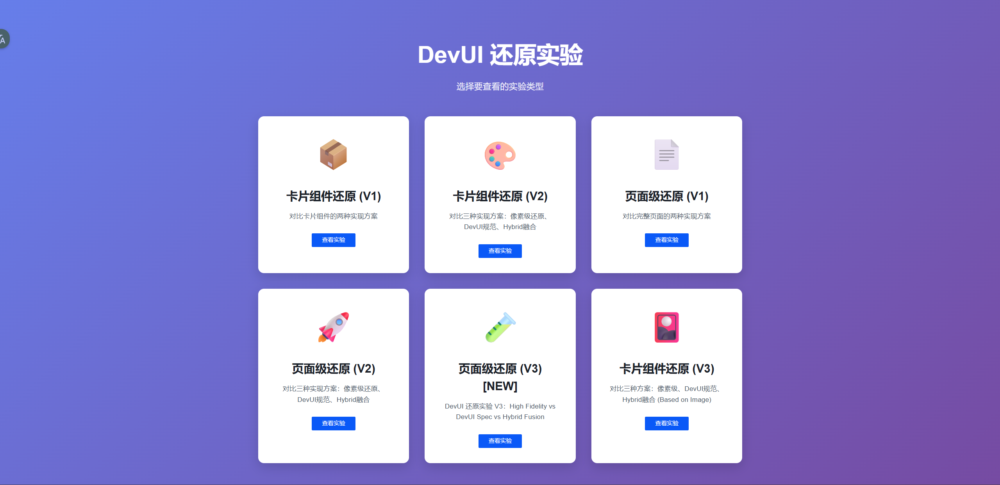
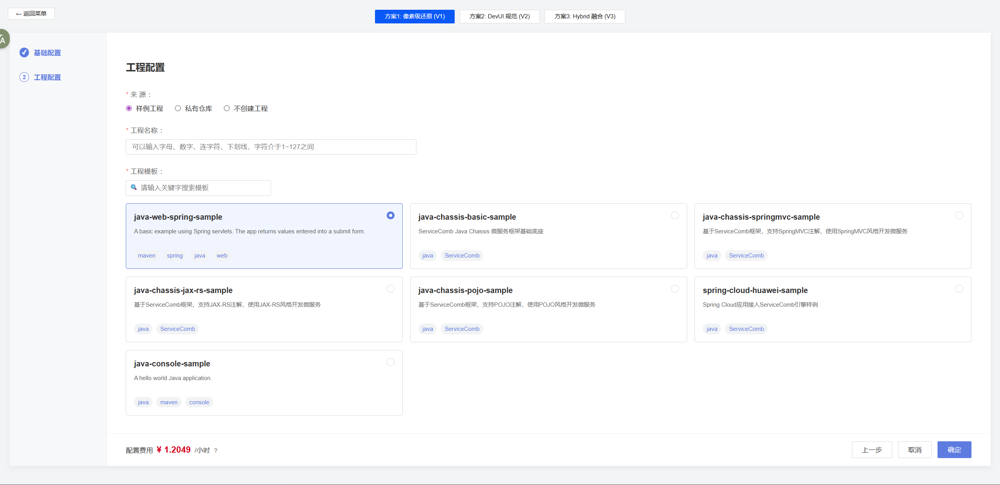

# DevUI Angular 组件还原与实践实验

**中文** | [English](./README_EN.md)

本项目是一个基于 **Angular** 和 **DevUI** 组件库的界面开发实践与探索项目。其核心目标是探索在高保真还原设计稿的过程中，如何平衡严格使用组件库与自定义开发之间的关系，并总结出一套最佳实践方法论。



## 🎯 项目目标

- **UI 还原度评估**：对比不同开发方案在还原设计稿上的表现。
- **验证「Hybrid Fusion」混合开发模式**：这是一种结合了组件库稳定性与自定义布局灵活性，并利用 Desing Token 保持风格统一的开发模式。
- **维护性评估**：分析不同开发策略在长期项目维护中的优劣势。

## 🧪 实验方法论

每个实验（Case Study）都会针对同一个设计目标，采用三种截然不同的方案进行开发：

### 1. 方案 V1：图生 UI 还原（像素级原生）
- **目标**：100% 还原图片效果，不考虑组件复用。
- **技术手段**：纯原生 HTML/CSS，人工微调像素。
- **优点**：视觉还原度极高，完全匹配设计稿。
- **缺点**：无组件库功能（验证、无障碍），难以维护，不支持主题切换。

### 2. 方案 V2：图生 UI 规范（组件库优先）
- **目标**：严格遵循 DevUI 组件库的使用规范。
- **技术手段**：仅使用 `d-*` 组件（如 `d-card`, `d-form`, `d-layout`），不进行非常规的样式覆盖。
- **优点**：高可维护性，完整的组件功能支持。
- **缺点**：当设计稿与组件库默认样式差异较大时，视觉还原度较低。

### 3. 方案 V3：Hybrid 融合性生成（推荐）
- **目标**：在保持高还原度的同时，保留组件库的核心能力与系统一致性。
- **技术手段**：
  - **灵活使用容器**：对于复杂布局，使用原生 Flex/Grid 替代受限的库容器（如 `d-form` 在 standalone 模式下的兼容问题）。
  - **组件复子级用**：内部原子元素使用库组件（`d-input`, `d-button`）。
  - **强制使用 Design Token**：所有样式必须引用 `var(--devui-*)` 变量，严禁硬编码颜色和间距。
- **优点**：高保真还原、系统风格统一、易于维护、视觉鲁棒性强。



## 📂 实验目录

本项目包含两大类实验系列：
- **Card 系列**：基础卡片组件的三种实现方案对比
- **Page 系列**：复杂页面（云服务控制台）的渐进式优化实验

| 实验名称 | 描述 | 代码位置 | 状态 |
|----------|------|----------|------|
| **Card V1** | 基础卡片 - 初版对比实验 | `src/app/card-experiment/` | ✅ 完成 |
| **Card V2** | 对比 HTML 原生 vs 组件库 vs 融合方案 | `src/app/card-experiment-v2/` | ✅ 完成 |
| **Card V3** | 基于 Hybrid UI Generator Skill 重构 | `src/app/card-experiment-v3/` | ✅ **验证 Skill 有效性** |
| **Page V1** | 云配置向导页 - 初版对比实验 | `src/app/page-experiment/` | ✅ 完成 |
| **Page V2** | 新增融合性方案生成 | `src/app/page-experiment-v2/` | ✅ 完成 |
| **Page V3** | 基于 llms.txt + Gemini 3 Pro 多模态模型 | `src/app/page-experiment-v3/` | ✅ **验证多模态识图与提示词工程** |
| **Page V4** | 云服务监控看板 - Dashboard 类型页面 | `src/app/page-experiment-v4/` | ✅ 完成 |
| **Page V5** | 华为云工单创建表单 - 复杂表单类型 | `src/app/page-experiment-v5/` | ✅ **验证复杂表单场景的 Hybrid 方案最佳实践** |


## 🚀 快速开始

### 环境依赖

- Node.js (v18+)
- Angular CLI (v17+)

### 安装

```bash
git clone <repository-url>
cd devui-angular-test/devui-app
npm install
```

### 运行项目

```bash
npm start
# 或
ng serve
```

访问 `http://localhost:4200/`。应用主页是一个仪表盘，用于选择并查看各个实验案例。

## 🛠 技术栈

- **框架**: Angular 18+
- **UI 组件库**: DevUI (ng-devui) 18.0.0
- **样式**: SCSS, CSS Variables (Design Tokens)
- **开发工具**: Angular CLI, TypeScript

## 🤖 AI 辅助开发

本项目是 AI 辅助 UI 开发的实践案例，展示了如何利用大语言模型和自定义技能来加速开发流程：

### AI 工具链
- **Claude Sonnet 4.5**：用于代码生成、架构设计和文档撰写
- **Gemini 3 Pro (Multimodal)**：用于图片识别、UI 规格提取和多模态理解
- **Custom Skills**：
  - `hybrid-ui-generator`：混合方案 UI 生成器技能（位于 `.claude/skills/hybrid-ui-generator/`）
  - `gen-llms-txt-pencil`：组件规范文档生成器

### 图生 UI 工作流
1. **输入设计稿**：提供设计图片 + 简要说明
2. **多模态识别**：Gemini 3 Pro 提取 UI 规格（布局、组件、颜色、间距）
3. **规范校正**：将识别结果映射到 DevUI Design Tokens
4. **Hybrid 决策**：根据技能文档决定哪些用原生容器、哪些用库组件
5. **代码生成**：生成 V1(像素还原)、V2(组件库)、V3(Hybrid) 三个版本
6. **质量验证**：对照技能文档的质量检查清单进行验证

### 技能系统架构
```
.claude/
└── skills/
    └── hybrid-ui-generator/
        ├── SKILL.md          # 主技能文档（1000+ 行设计方法论）
        ├── llms.txt          # DevUI 组件规范速查表
        └── llms-full.txt     # DevUI 完整组件 API 文档
```

## 💡 核心经验总结

### 1. Design Tokens 是系统一致性的基石
- **统一视觉语言**：使用 `var(--devui-primary)` 而非硬编码颜色值，确保主题切换和全局样式调整的便利性
- **规范校正策略**：多模态识别的边距、字体、颜色不一定准确，需结合 Design Token 库进行规范化映射
- **零硬编码原则**：Hybrid V3 方案中严格禁止任何魔法数字（magic numbers）和内联样式

### 2. Hybrid 方案的三层架构
从 V3-V5 的实验中提炼出清晰的分层策略：
- **Layer 1 (Layout)**：原生 CSS Grid/Flex 处理页面级布局（如三栏式、仪表板网格）
- **Layer 2 (Structure)**：混合使用原生容器 + 库组件子元素（如表单分组、工具栏）
- **Layer 3 (Controls)**：100% 使用组件库的交互控件（`d-button`, `d-select`, `d-text-input` 等）

### 3. 复杂场景最佳实践（源自 Page V5 实验）
- **表单字段布局**：使用原生 `<div class="hybrid-field-row">` + Flex，内嵌 DevUI 表单控件
- **富文本工具栏**：使用 DevUI `d-button bsStyle='text'` + 原生分隔符实现像素级还原
- **元数据面板**：垂直表单使用原生容器 + DevUI `d-select`/`d-datepicker` 实现紧凑布局

### 4. 容器决策树（Container Decision Framework）
```
需要容器 → 组件库提供？
  ├─ 否 → 原生 + Design Tokens ✓
  └─ 是 → 在当前环境工作？
       ├─ 否 → 原生容器 + 库子组件 ✓ (如 standalone 模式下的 d-form 问题)
       └─ 是 → 满足设计需求？
            ├─ 否 → 原生容器 + 库子组件 ✓
            └─ 是 → 使用库容器 ✓
```

### 5. 技能协议化（Skill Formalization）
- **Hybrid UI Generator Skill**：将混合方案标准化为可复用的设计决策流程（位于 `.claude/skills/`）
- **多模态识图与校正**：V3 证明了 Gemini 3 Pro + 结构化 UI Spec 的有效性
- **组件覆盖率目标**：表单控件和按钮 100% 使用库组件，布局容器根据需求灵活选择

---

## 📚 相关资源

- **DevUI 官方文档**: [ng-devui.github.io](https://ng-devui.github.io/)
- **DevUI GitHub**: [github.com/DevCloudFE/ng-devui](https://github.com/DevCloudFE/ng-devui)
- **设计令牌参考**: DevUI Design Tokens (`node_modules/ng-devui/styles-var/devui-var.scss`)
- **实验文档**: 每个实验目录下的 `EXPERIMENT_LOG.md` 文件

## 📝 更新日志

### 2026-02-07
- ✅ 完成 **Page V5** 实验 - 华为云工单创建表单，验证复杂表单场景
- 📘 更新 **Hybrid UI Generator Skill** 到 v2.0.0，新增多模态识图与规范校正章节
- 🔧 优化 Hybrid V3 方案的质量验证清单，增加细粒度检查项

### 2026-02-05
- ✅ 完成 **Page V4** 实验 - 云服务监控看板
- 📝 扩充 `llms-full.txt` 组件规范文档

### 2026-02-03
- ✅ 完成 **Page V3** 实验 - 结合 Gemini 3 Pro 多模态能力
- 🧪 验证多模态模型 + 提示词工程的有效性

### 2026-02-02
- ✅ 完成 **Card V3** 实验 - 基于新版 Hybrid UI Generator Skill
- 📘 首次验证技能文档的可执行性和有效性

---

*本项目使用 **Gemini 3 Pro (High)** & **Claude Sonnet 4.5** 协同开发*  
*最后更新: 2026-02-08*
